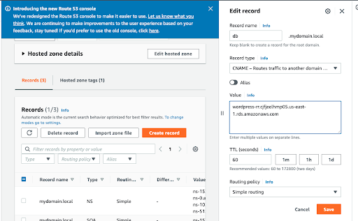

## Overview

Covers
* enabling Multi-AZ 
* creating a read replica
* promoting a read replica
* updating the RDS endpoint in Route 53

## initial-singleAZ-setup 
 
## initial-loadBalancer-setup 
 
## convert-to-multiAZ 
 
## event-log-multiAZ 
 
## Create-read-replica 
 
## Creating-read-replica 
 
## Promote-read-replica 
 
## Promoting-read-replica 
 
## Promoting-readReplica-eventLog 
 
## DNS-record-original 
 
## DNS-record-update 
 

